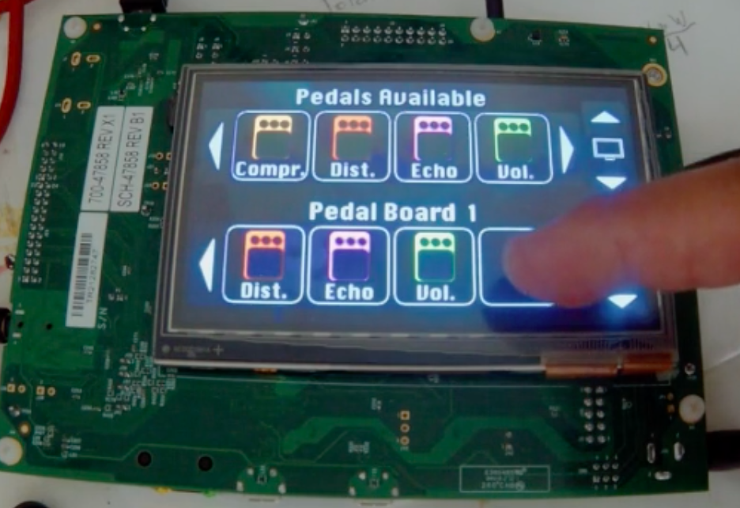
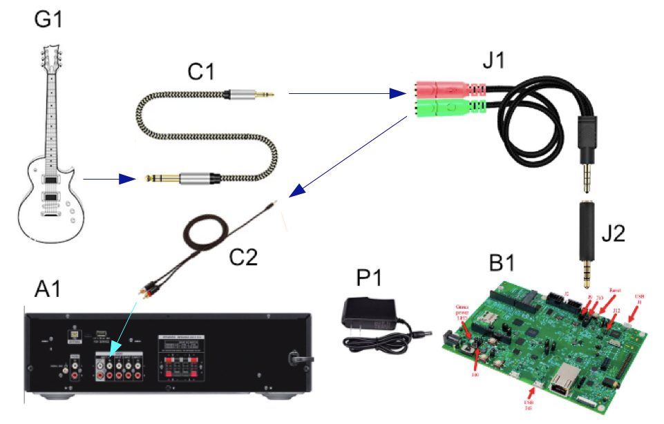

# Branch overview
The focus of this fork/branch is the Embedded Guitar Pedals Build for NXP RT1060 (MIMXRT1060-EVKB with RK043FN66HS-CTG).<br>
For RT-Thread specifics go to master branch.
<br>



# Videos
## App Demo:
[https://rumble.com/v1f4p11-guitar-pedals-powered-by-rt-threads-and-lvgl.html](https://rumble.com/v1f4p11-guitar-pedals-powered-by-rt-threads-and-lvgl.html)
## Build Part 1:
[https://rumble.com/v1f4cm3-build-guitar-pedals-linux-part-1.html](https://rumble.com/v1f4cm3-build-guitar-pedals-linux-part-1.html)
## Build Part 2:
[https://rumble.com/v1f4d6w-build-guitar-pedals-linux-part-2.html](https://rumble.com/v1f4d6w-build-guitar-pedals-linux-part-2.html)


# Building RT-Thread using Linux

## Preparation
We will add packages and fix path for python if necessary

### Install packages

```
sudo apt install -y gcc python3 python3-pip gcc-arm-none-eabi \
 binutils-arm-none-eabi scons libncurses5-dev qemu qemu-system-arm git
```

### Fix default python
Check if "python" command works (type exit() to close python).<br>
If worked then skip this item.<br>
Otherwise, perform the same check for python3.

If python3 does not work try:
```
sudo apt install -y python3
```
Assuming python3 is installed:

- Check the real location of python3 using "which python3" command:
```
which python3
```
- next, do the following (replacing /usr/bin by your path in case different):
```
sudo ln -s /usr/bin/python3 /usr/bin/python
```


## Clone this Varanda's rt-thread repo:
```
git clone -b guitar-pedals https://github.com/Varanda-Labs/rt-thread.git
```

## While Guitar Pedals package is not in the main rt-thread repository we will redirect it.
```
export RTT_PACKAGE_URL=https://github.com/Varanda-Labs/packages.git
export RTT_PACKAGE_BRANCH=guitar-pedals
```

For NXP boards, you need to set RTT_EXEC_PATH with the location of the NXP SDK, for example:
```
export RTT_EXEC_PATH=/Users/mvaranda/SDK_2_11_1_EVK-MIMXRT1060
```

You may consider adding these lines into your ~/.bashrc file (on Mac: ~/.zshrc file).<br>
Then, you do not need to do these exports everythime you launch a shell, bash or ssh session.

### Removing existing ~/.env directory
we remove ~/.env as we are redirecting package URL:
```
rm -rf ~/.env
```

## Selecting the target
For build/running on QEMU simulator:
```
cd rt-thread/bsp/qemu-vexpress-a9/
```
for NXP RT1060:
```
cd rt-thread/bsp/rt1060/
```


## Config RT-Thread
```
scons --menuconfig
```

Configuration should be all good by default. But even so you need to run this command so it can fetch/build ~/.env directory.<br>
You can just exit without changing any option.
<br>

Then:
```
source ~/.env/env.sh
pkgs --update
scons
./qemu.sh
```

To run on simulator:
```
./qemu.sh
```

To run on RT1060:
The RTT building system generates .elf file. The MCUXpressoIDE and tools expect .axf file.
It suggests that also accepts .bin but it did not work for me by using linkServer.<br>

The only way I got it working was replacing the onboard debugger firmware by Segger's.
- The good: you can use J-Link either from MCUXpressoIDE or via J-FlashLite.
- The bad: USB power does not work anymore. You need to power the board via power jack connector.

To flash Segger firmware follow [this](https://community.nxp.com/t5/i-MX-RT-Knowledge-Base/Using-J-Link-with-MIMXRT1060-EVKB/ta-p/1452717) link.
<br>
BTW, I brick the board a couple times. I follow the instructions from [this](https://dzone.com/articles/regaining-debug-access-to-nxp-imx-rt1064-evk-execu) link to recover it. The USB to recover should be the one next to the Ethernet connector.<br> 
- Using JFlashLite you select the .bin file and offset 0x60000000. But you can not debug, just run.
- to debug: create a dummy RT1060 project in your MCUXpressoIDE; in its Debug settings point it to your rtthread.elf file. Disable auto-build. The C files in this dummy project can be anything as it does not matter. The Debugging section will automatically bring the correct source code from your real project.

# Building RT-Thread using Mac
## Preparation
Install MacPorts from [here](https://www.macports.org/)
<br>Then:
```
sudo port install qemu
sudo port install scons
sudo port install ncurses
sudo port install arm-none-eabi-gcc
export PATH=$PATH:/opt/local/bin
git clone -b lua-eos-01 https://github.com/mvaranda/rt-thread
cd rt-thread/bsp/qemu-vexpress-a9/
```


Either export RTT_EXEC_PATH=/opt/local/bin or edit file rtconfig.py
```
Change line:
  from:
    EXEC_PATH   = r'/usr/bin'
  to:
    EXEC_PATH   = r'/opt/local/bin'
```

## Add packages

To use packages, need python requests package.<br>

if no pip:
```
curl -O https://bootstrap.pypa.io/pip/2.7/get-pip.py
python get-pip.py
python -m pip install --upgrade "pip < 21.0"
python -m pip install requests
```

The next steps are the same than the above Linux's "Config RT-Thread"

# Hardware
Disclamer: Audio drivers were not yet integrated. The following suggested hardware were not tested yet. There is a small chance that a pre-amp between guitar and C1 would be required.

## BOM:
| ref | Description                                                   | link        |
|-----|---------------------------------------------------------------|-------------|
| G1  | Your Guitar | |
| C1  | Guitar 6.35mm male to 3.5mm male (cable) | [Amazon](https://www.amazon.ca/Gold-Plated-Terminal-Housing-Cellphone-Amplifiers/dp/B08LT2R5S2/ref=pd_bxgy_sccl_2/136-4440533-4607710) |
| J1 | ENVEL 3.5mm Jack Cable Headset Adapter Kit CTIA |[Amazon](https://www.amazon.ca/gp/product/B087CQM8KK/ref=ppx_yo_dt_b_search_asin_title)|
| J2 | Male to Female Headphone Audio Adapter,3.5mm OMTP to CTIA Conversion Earphone Adapter |[Amazon](https://www.amazon.ca/Pomya-Headphone-Conversion-Compatible-Smartphones/dp/B0863VJWL1/ref=sr_1_1_sspa)|
| B1 | NXP MIMXRT1060-EVKB (with LCD RK043FN66HS-CTG)|[NXP](https://www.nxp.com/design/development-boards/i-mx-evaluation-and-development-boards/i-mx-rt1060-evaluation-kit:MIMXRT1060-EVKB)|
| C2 | 3.5mm to 2 RCA Male to Male Aux Audio Cable| [Amazon](https://www.amazon.ca/UGREEN-Connector-Speakers-Smartphone-Devices/dp/B015PZ7QO2/ref=sr_1_3)|
| A1 | Your amplifier| |
| P1 | Power supply | [Amazon](https://www.amazon.ca/100-240V-5-52-5mm-Transformer-Electronic-Equipment/dp/B086JRWFD9/ref=sr_1_1_sspa)|

## Connections:

